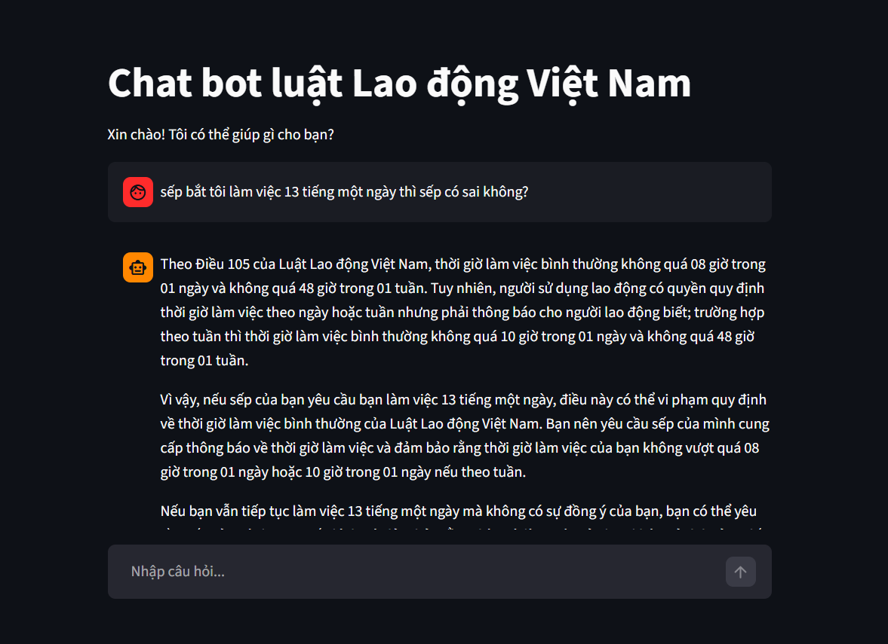
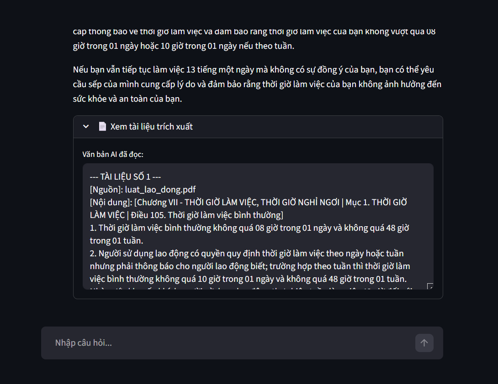

# Legal RAG Bot - Vietnamese Labor Law Assistant

An advanced, AI-powered conversational agent designed to provide highly accurate, context-grounded legal advice regarding Vietnamese Labor Law. Built on a state-of-the-art **Retrieval-Augmented Generation (RAG)** architecture, it ensures that all answers are strictly based on actual legal texts, preventing AI hallucinations.


---

## 1. Project Overview
Understanding labor law can be difficult for students who have never worked before and for people who are just entering the job market. Important topics such as employment contracts, probation periods, overtime regulations, salaries, insurance, and employee rights are often buried inside long and complex legal documents written in formal language.

The **Legal RAG Bot** was built to make Vietnamese labor law more accessible and easier to understand. By ingesting raw legal documents such as PDFs, text files, and scanned images, the system can understand the hierarchical structure of legal documents (Chapters, Sections, Articles) and provide accurate, context-aware answers to user questions. This helps students and new employees quickly find reliable legal information without needing to manually search through hundreds of pages of regulations.

When a user asks a question, the system searches its database, retrieves the most relevant legal clauses, and uses high-speed Large Language Models (**Groq**) to synthesize a coherent, accurate, and professional answer.

## 2. Current Features
- **Intelligent Data Ingestion & OCR:** Automatically converts PDFs to Markdown. If a scanned PDF is detected, it triggers Tesseract OCR to extract text from images.
- **Semantic Chunking:** Preserves the legal context by splitting documents based on Markdown headers (Chapter, Section, Article) rather than blind character counts.
- **Hybrid Search (Retrieval):** Combines Semantic Search (Dense retrieval via **ChromaDB** & `vi-sbert`) with Keyword Search (Sparse retrieval via **BM25**) to maximize finding exact legal matches.
- **Cross-Encoder Re-ranking:** Uses `BAAI/bge-reranker-v2-m3` to re-score and filter the retrieved documents, ensuring only the most highly relevant context is sent to the LLM.
- **Conversational Memory:** Automatically rephrases user queries based on chat history to maintain context in multi-turn conversations.
- **Strict Guardrails:** The LLM is strictly prompted to answer *only* using the provided context. If the law doesn't cover the user's question, the bot safely declines to answer.
- **Built-in RAG Evaluation:** Integrated with the **Ragas** framework to automatically evaluate the pipeline's performance across metrics like Faithfulness, Answer Relevancy, Context Precision, and Context Recall.


## 3. Architecture
The system architecture is divided into two main phases: **Data Preparation (Offline)** and the **RAG Pipeline (Online)**.

### Phase 1: Data Preparation (Offline)
This pipeline is executed whenever new legal documents are added to the system.
```text
===================================================================
           PHASE 1: INGESTION PIPELINE
===================================================================

       [ Raw Legal Documents (PDFs, Scans, TXT) ]
                           │
                           ▼
       [ Text Extraction (PyMuPDF4LLM / Tesseract OCR) ]
                           │
                           ▼
       [ Semantic Chunking (Split by Chương, Mục, Điều) ]
                           │
             ┌─────────────┴─────────────┐
             ▼                           ▼
      [ vi-sbert Embeddings ]     [ Keyword Indexer ]
             │                           │
             ▼                           ▼
       [( Chroma DB )]            [( BM25 Pickle )]
       (Dense Vectors)            (Sparse Keywords)
```
### Phase 2: RAG Pipeline (Online):
This pipeline runs in real-time when a user interacts with the Chatbot UI.
```text
===================================================================
           PHASE 2: QUERY PIPELINE
===================================================================

                    [ User Input ]
                           │
                           ▼
                  [ Query Rephraser ] ◄──────── (Chat History)
                           │
                  (Standalone Query)
                           │
             ┌─────────────┴─────────────┐
             ▼                           ▼
       [ Chroma DB ]               [ BM25 Pickle ]
      (Dense Search)               (Sparse Search)
             │                           │
             └─────────────┬─────────────┘
                           ▼
               [ Merge & Deduplicate ]
                           │
                           ▼
          [ Cross-Encoder (BAAI/bge-reranker) ]
            (Re-scores and filters top docs)
                           │
                     (Top 3 Docs)
                           │
                           ▼
                    [ Groq LLM ] 
             (Strict Guardrail Prompt)
                           │
                           ▼
            [ Final Answer + Source Context ]
                    (Streamlit UI)
```

## 4. Future Improvements
While the current RAG pipeline is robust, the following advanced features are planned for future releases to achieve enterprise-level accuracy and reasoning:

- **Structured Legal Parsing:** Enhance the parsing engine to better understand and map the relationships between Laws, Decrees, and Circulars.
- **Neo4j Graph Retrieval:** Transition to Knowledge Graph RAG (GraphRAG) to understand the relational context (e.g., "Article X is modified by Decree Y").
- **Advanced Reranking fine-tuning:** Fine-tune domain-specific Vietnamese legal cross-encoders to improve the current reranking precision.
- **Continuous RAG Evaluation:** Integrate the Ragas evaluation script into a CI/CD pipeline to automatically benchmark the system whenever the document base or prompts are updated.
- **Citation Grounding:** Implement mechanisms in the UI to highlight the exact sentences/words in the source text that the LLM used to construct its answer.
- **Agentic Workflow:** Upgrade from a static LCEL chain to a dynamic **LangGraph** agent. This will allow the bot to route queries, perform web searches for recent news if the DB lacks info, and handle multi-step legal reasoning.

## 5. Demo

| Chat Interface | Context Verification |
| :---: | :---: |
|  |  |
| *Smooth conversational UI with Groq LLM* | *Users can inspect the exact legal clauses used* |

## 6. Setup

### Prerequisites
Because this project handles deep PDF extraction and Scanned documents, you **must** install the following system dependencies before installing Python packages:
1. **Tesseract OCR:** 
   - Windows: [Download Installer](https://github.com/UB-Mannheim/tesseract/wiki). Ensure it's installed at `C:\Program Files\Tesseract-OCR\tesseract.exe`.
   - Linux: `sudo apt-get install tesseract-ocr`
   - Mac: `brew install tesseract`

### Installation

**Step 1: Clone the repository**
```bash
git clone <your-repo-url>
cd <your-project-folder>
```

**Step 2: Create a virtual environment & Install dependencies**
```bash
python -m venv venv
source venv/bin/activate  # On Windows use: venv\Scripts\activate
pip install -r requirements.txt
```

**Step 3: Environment Variables**

Create a `.env` file in the root directory and add your Groq API Key:

```bash
GROQ_API_KEY=your_groq_api_key_here
```

### Installation

**Step 4: Data Ingestion (Create Vector DB)**
```bash
python src/vector_db.py
```
*This will create the `chroma_db` directory and `bm25_retriever.pkl.`*

**Step 5: Run the Chatbot UI**
```bash
streamlit run app.py
```
Access the application in your browser at http://localhost:8501.

**Step 6: Run System Evaluation (Optional)**

Evaluate the pipeline's accuracy using the built-in AI Judge:

```bash
# Run evaluation with the default question set
python evaluate.py

# View detailed results for each question
python evaluate.py --verbose

# Save results to a CSV file
python evaluate.py --output results.csv
```
